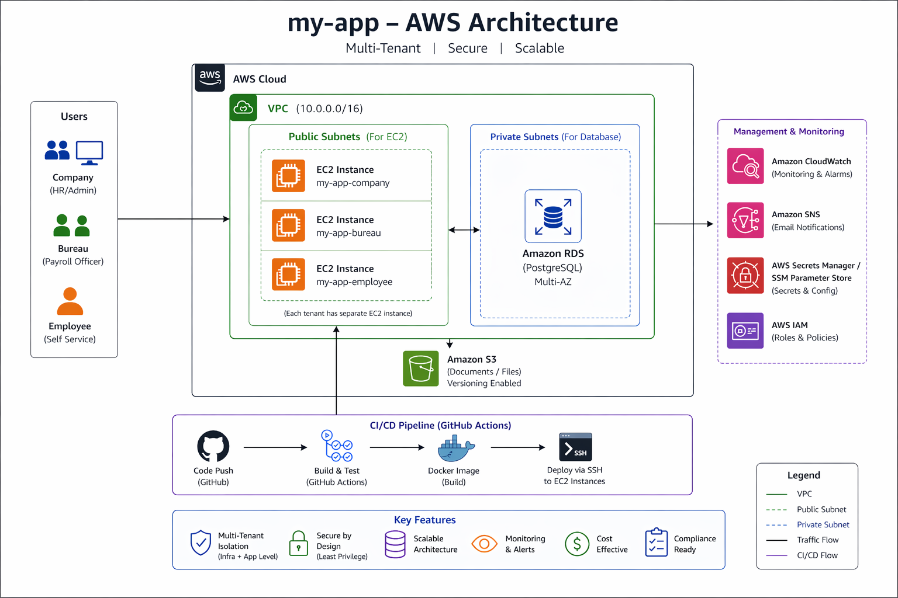

## Overview
This project illustrates a reliable and highly scalable multi-tenant AWS architecture to support the payroll application that processes sensitive data like employee data and financial information.

The architecture has been built considering security, tenant isolation, and production-ready implementation.

---
## Architecture Diagram

## Architecture Overview

- VPC with public and private subnets spanning multiple availability zones
- EC2 instances created for each type of tenant (Company, Bureau, Employee)
- RDS PostgreSQL hosted in private subnets
- S3 bucket with versioning to store documents
- IAM roles following the principle of least privilege based on tenants
- Security groups limiting network access
- CI/CD pipeline using GitHub Actions and Docker images
- Monitoring using CloudWatch and SNS notifications

---

## Important Design Considerations

### 1. Network Segmentation
- Public subnets have EC2 instances running on them
- Private subnets host RDS PostgreSQL
- Internet Gateway connected to the public layer only

This ensures that sensitive resources such as the database are isolated from external networks.

---

### 2. Isolated Computing Resources
- EC2 instances for each tenant type:
  - Company
  - Bureau
  - Employee
---
---

### 3. Multi-Tenancy Strategy
- Shared database with tenant_id filters
- Tenant scope via authentication (JWT tokens)

All queries must specify tenant_id to avoid cross-tenancy data access.

---

### 4. Defense-in-Depth Strategy
- Filtering by tenant_id at application level
- IAM-based access management
- Security group network access controls

Even if one method is compromised, others will safeguard the system.

---

## Security Measures

### IAM and Access Management
- Dedicated IAM roles for each tenant category
- Follows principle of least privilege
- No sharing of credentials between tenants

### Secret Handling
- Store RDS password in AWS SSM Parameter Store
- No use of hard-coded credentials in source code

### Network Controls
- Limited SSH access to designated IP address
- Only EC2 security group can connect to RDS
- Public access to RDS database is forbidden

### Encryption
- Database and S3 bucket encryption configured (conceptual)
- Secure encrypted communication channel assumed

---

## Deployment Process

### CI/CD Workflow
- Automated upon main branch push
- Creates Docker image of the application
- Copies image to EC2 server using SSH protocol
- Deploys application inside container on EC2 host

It automates deployment without third-party container repository services.

---

## Monitoring and Alerts

### CloudWatch Alarms
- For EC2 CPU usage
- For RDS connection limits

### Notification Service
- Utilize SNS for alarm notifications

These measures help detect issues proactively.
---
## Incident Management 

There will be a runbook for the management of critical issues, including a runbook for handling a data breach issue that would involve:
- Detection
- Investigation
- Recovery
- Prevention

---

## Compliance Considerations (UK GDPR)

### Data Protection 
- Use encryption both in transit and at rest 
- Use strict access control with IAM 

### Data Location
- Design to host infrastructure in EU / UK region

### Right to be Forgotten
- Allow data erasure from:
  - Database 
  - S3
- Disable access through IAM 

---

## Additional Comments

- Defined the infrastructure in Terraform
- The infrastructure is deployable on AWS platform
- Actual deployment was not done as part of this assignment
- Use placeholder EC2 access for CI/CD process

---

## Directory Structure

- terraform/ -> IAC  
- app/ -> Docker Application
- .github/workflows/deploy.yml -> CI/CD Process
- docs/ -> Architecture & Runbook

## UK GDPR Compliance Considerations

### 1. AWS-Native Controls for Protecting Personal Information

To make sure i handle information like employee personal details and banking information securely i use the following controls that are built into Amazon Web Services:

- **Encryption when Data is Stored**

i set up RDS and S3 to use encryption so that the data i store is protected

- **Encryption when Data is Transferred**

i design all communication between services to use HTTPS/TLS so that data is protected when it is being transferred

- **Identity and Access Management**

i use role-based access control and make sure each role has the least amount of privilege necessary

i have separate roles for the Company, Bureau and Employee

- **Secrets Management**

i store database credentials in the AWS SSM Parameter Store, which's a secure way to store sensitive information

i do not hardcode secrets into our code

- **Network Isolation**

i deploy RDS in private subnets

i restrict access using security groups so only EC2 is allowed to access the data

- **Monitoring and Logging**

i use CloudWatch to monitor and get alerts

Our logs support audit and compliance requirements

These controls help us make sure that sensitive information is kept confidential is not changed without permission and is only accessed by people who are allowed to.

---

### 2. Data Residency in the UK and EU

Our current infrastructure is set up in the **us-east-1 region** for development and demonstration purposes.

For UK GDPR compliance in a production environment:

- i would set up the infrastructure in a **UK or EU region, like eu-west-2 in London**

- i would restrict all services, including EC2, RDS and S3 to that region

- i would not allow data to be transferred between regions unless it is explicitly required

This way i make sure that sensitive information stays within the UK or EU when it is required to.

---

### 3. Right to Erasure, which Means Deleting Data

To support the GDPR "Right to Erasure" our system is designed to allow us to completely remove data:

- **Deleting Data from the Database**

i can delete all user data using a filter based on the tenant_id

- **Removing Data from S3**

i user-related documents from S3 including old versions of the documents

- **Revoking Access**

i take away IAM access, for the user or tenant

- **Logging Audit Information**

i log all deletion actions so that i can trace what happened and comply with regulations

This ensures that i can completely remove user data from all services.